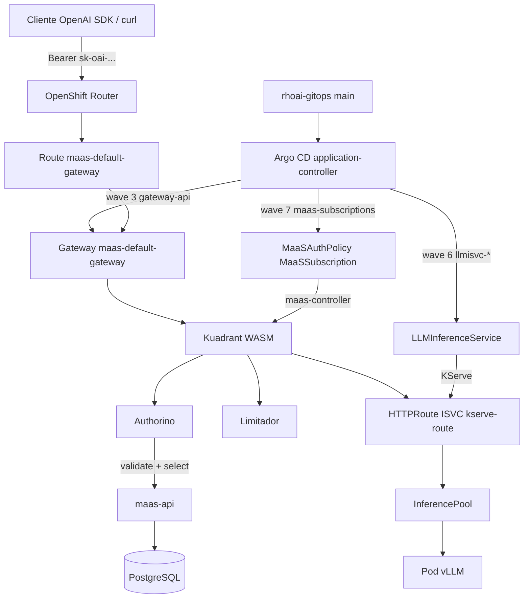
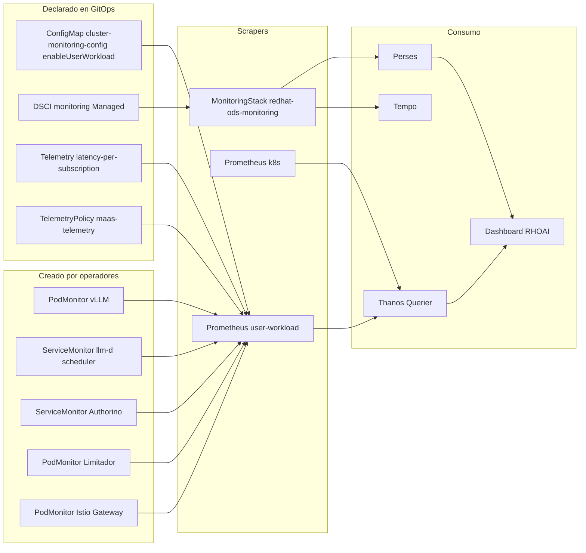
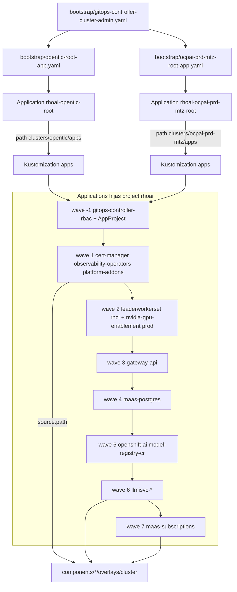
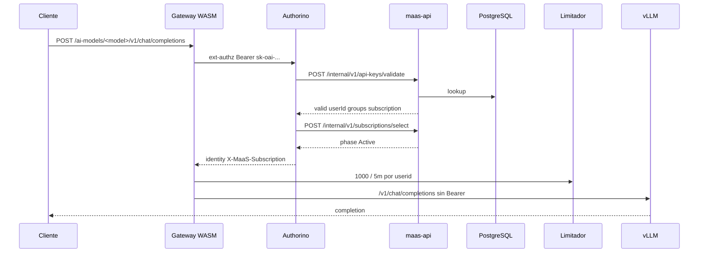

# Arquitectura — OpenShift GitOps (Kustomize) para RHOAI 3.4 y MaaS

Documento de arquitectura de [`abelluque/rhoai-gitops`](https://github.com/abelluque/rhoai-gitops): fuente de verdad GitOps (Argo CD + Kustomize, patrón **apps-of-apps**) para Red Hat OpenShift AI 3.4 y Models-as-a-Service.

Los hechos de runtime se contrastaron el 26 de agosto de 2026 contra el laboratorio OpenTLC (`cluster-zd9hr`, sandbox1414), donde la Application raíz `rhoai-opentlc-root` reconcilia `clusters/opentlc/apps` de este repositorio (`targetRevision: main`). El overlay `ocpai-prd-mtz` está declarado aquí y no está desplegado en ese contexto.

| Dato | Valor |
| --- | --- |
| Remoto canónico | `https://github.com/abelluque/rhoai-gitops.git` |
| Application raíz lab | `rhoai-opentlc-root` → `clusters/opentlc/apps` |
| Application raíz prod | `rhoai-ocpai-prd-mtz-root` → `clusters/ocpai-prd-mtz/apps` |
| AppProject | `rhoai` (wave −1) |
| Producto observado | OpenShift AI Self-Managed **3.4.3**, DSC `default-dsc` Ready |
| Serving observado | KServe **v0.17.0**, vLLM **v0.18.0**, llm-d inference-scheduler **v0.7.1** |

Este repositorio **no** contiene charts Helm. Los YAML bajo `components/` son el estado deseado. El importador opcional `hack/import-from-helm.sh` puede regenerarlos desde un checkout hermano [`rhoai-helm`](https://github.com/abelluque/rhoai-helm); no es prerrequisito de instalación.

---

## 1. Resumen ejecutivo

GitOps declara el clúster: OpenShift GitOps (Argo CD) aplica overlays Kustomize versionados. Una Application raíz materializa un `AppProject` y Applications hijas; cada hija apunta a `components/<app>/overlays/<cluster>`.

### Propósito

- Instalar y mantener la pila de plataforma, Connectivity Link, Gateway API, RHOAI 3.4, `LLMInferenceService` y suscripciones MaaS **sin** un árbol Helm en el clúster.
- Separar laboratorio OpenTLC y producción `ocpai-prd-mtz` con overlays autosuficientes (el overlay de producción **no** hereda el `base` de laboratorio).
- Ordenar dependencias con `argocd.argoproj.io/sync-wave` (−1…7) y Jobs `PostSync` (equivalente a los hooks Helm post-install).

### Patrones de diseño

| Patrón | Uso en este repo |
| --- | --- |
| **Apps-of-apps** | Bootstrap aplica una Application raíz; esa raíz sincroniza `clusters/<cluster>/apps` (AppProject + hijas). |
| **Kustomize base / overlay** | Lab: `components/<app>/base` + `overlays/opentlc` (a menudo solo `resources: [../../base]`). Prod: manifiestos completos en `overlays/ocpai-prd-mtz`. |
| **Sync waves** | Operadores OLM (1–2) → Gateway (3) → Postgres MaaS (4) → DSC / ModelRegistry (5) → modelos (6) → suscripciones (7). |
| **Server-Side Apply** | `ServerSideApply=true`, `CreateNamespace=true`, `prune: false`. `SkipDryRunOnMissingResource` en CRs cuyo CRD aún no existe. |
| **Gateway API** | `GatewayClass` `openshift-default` (`openshift.io/gateway-controller/v1`). Sin Application de Service Mesh 3. |
| **Kuadrant / Authorino / Limitador** | Chart RHCL renderizado a Jobs + Subscription. El `maas-controller` genera AuthPolicy / TokenRateLimitPolicy en runtime. |
| **KServe LLMInferenceService** | RawDeployment + InferencePool + scheduler llm-d. Router hacia `maas-default-gateway`. |
| **Bootstrap RBAC** | Chicken-and-egg: `oc apply -f bootstrap/gitops-controller-cluster-admin.yaml` **antes** de la raíz, porque la hija `gitops-controller-rbac` no puede crear su propio `ClusterRoleBinding` sin `cluster-admin`. |

Overlays:

| Overlay | Application raíz | Inferencia | Storage | Postgres MaaS | GPU Operator |
| --- | --- | --- | --- | --- | --- |
| `opentlc` | `bootstrap/opentlc-root-app.yaml` | Granite 3.1 2B CPU | `gp3-csi` | In-cluster | No |
| `ocpai-prd-mtz` | `bootstrap/ocpai-prd-mtz-root-app.yaml` | Granite 8B, Qwen 32B, DeepSeek 33B en H200 | `nutanix-files-dynamic` | Externo (`existingSecret`) | NFD + NVIDIA |

El overlay OpenTLC plantilla `maas.apps.cluster-6f7dh.6f7dh.sandbox3519.opentlc.com`. El clúster vivo observado es `cluster-zd9hr` (`router-default.apps.cluster-zd9hr.zd9hr.sandbox1414.opentlc.com`). El Route está Admitido; el hostname del spec no coincide con el DNS actual del sandbox.

---

## 2. Arquitectura de infraestructura y componentes

### 2.1 Vista por capas

```text
┌────────────────────────────────────────────────────────────────────────┐
│ bootstrap/  (cluster-admin)                                            │
│   gitops-controller-cluster-admin.yaml                                 │
│   opentlc-root-app.yaml  |  ocpai-prd-mtz-root-app.yaml                │
└────────────────────────────────────────────────────────────────────────┘
                                    │
┌────────────────────────────────────────────────────────────────────────┐
│ clusters/<cluster>/apps  (App-of-Apps, reconciliado por la raíz)       │
│   AppProject rhoai · Applications hijas (sync-wave −1…7)               │
└────────────────────────────────────────────────────────────────────────┘
                                    │
┌────────────────────────────────────────────────────────────────────────┐
│ components/<app>/overlays/<cluster>  (Kustomize, estado deseado)       │
└────────────────────────────────────────────────────────────────────────┘
                                    │
          ┌─────────────────────────┴─────────────────────────┐
          ▼                                                   ▼
┌─────────────────────────────┐                 ┌─────────────────────────┐
│ Plataforma e ingreso        │                 │ Planos IA y MaaS        │
│ GitOps · cert-manager · UWM │                 │ DSC · KServe · vLLM     │
│ Gateway · Route reencrypt   │                 │ Kuadrant · maas-api     │
└─────────────────────────────┘                 └─────────────────────────┘
```

### 2.2 Plataforma y GitOps

| Application | Path Kustomize | Namespace destino | Rol |
| --- | --- | --- | --- |
| `gitops-controller-rbac` | `components/gitops-controller-rbac/overlays/<cluster>` | cluster | `ClusterRoleBinding` `cluster-admin` al SA `openshift-gitops-argocd-application-controller`. Necesario para SSA en `openshift-ingress`, operadores y RHOAI. |
| `cert-manager` | `components/cert-manager/overlays/<cluster>` | `cert-manager-operator` | Operador cert-manager. Prod: InstallPlan Manual + Job de approve. |
| `observability-operators` | `components/observability-operators/overlays/<cluster>` | `openshift-operators` | Tempo, OpenTelemetry, Cluster Observability (Perses). |
| `platform-addons` | `components/platform-addons/overlays/<cluster>` | `rhoai-model-registries` | GitOps + Pipelines (Subscriptions), MinIO/MySQL del registry, PVCs, Jobs de nodePlacement. |
| `nvidia-gpu-enablement` | `components/nvidia-gpu-enablement/overlays/ocpai-prd-mtz` | `openshift-nfd` | **Solo prod.** NFD + GPU Operator + ClusterPolicy. |
| `leaderworkerset` | `components/leaderworkerset/overlays/<cluster>` | `openshift-lws-operator` | Requisito KServe llm-d. Job `PostSync` aplica la instancia LWS. |

`platform-addons` no incluye el CR `ModelRegistry`: va en Application aparte `model-registry-cr` (wave 5) para esperar las CRD del operador RHOAI. El CR usa `kubeRBACProxy: {}` (no `oauthProxy`) por la regla CEL de RHOAI 3.4.

Jobs que en Helm eran hooks se anotan `argocd.argoproj.io/hook: PostSync` y `hook-delete-policy: BeforeHookCreation`.

### 2.3 Plano de control de IA

Application `openshift-ai` → `components/openshift-ai/overlays/<cluster>` → `redhat-ods-operator`.

Manifiestos típicos del overlay: Subscription `rhods-operator` (`stable-3.x`), Jobs `apply-dsci` / `apply-dsc` / `apply-odh-dashboard-config`, HardwareProfiles, Telemetry Istio, TelemetryPolicy Kuadrant, NetworkPolicy de Authorino, `cluster-monitoring-config` (`enableUserWorkload: true`).

DSC observado (`default-dsc`): KServe + ModelsAsService, Dashboard, ModelRegistry, Llama Stack, TrustyAI, Workbenches **Managed**; pipelines/kueue/ray/trainer **Removed**; `serviceMesh.managementState: Removed`.

Modelos (wave 6):

| Application | Overlay | LLMInferenceService | Hardware |
| --- | --- | --- | --- |
| `llmisvc-granite` | `components/llmisvc-granite/overlays/opentlc` | `granite-3-1-2b-instruct` | CPU, `rhaii/vllm-cpu-rhel9:3.4.1`, `workload.rhoai.io/platform=true` |
| `llmisvc-granite-8b` | `…/llmisvc-granite-8b/overlays/ocpai-prd-mtz` | `granite-3-0-8b-instruct` | GPU H200 |
| `llmisvc-qwen25-coder-32b` | `…/llmisvc-qwen25-coder-32b/overlays/ocpai-prd-mtz` | `qwen25-coder-32b` | GPU H200 FP8 |
| `llmisvc-deepseek-coder-33b` | `…/llmisvc-deepseek-coder-33b/overlays/ocpai-prd-mtz` | `deepseek-coder-33b` | GPU H200 |

Cada ISVC declara `router.gateway.refs` hacia `maas-default-gateway` en `openshift-ingress`. KServe crea en runtime HTTPRoute, InferencePool, ServiceMonitors del scheduler y PodMonitor vLLM.

### 2.4 Plano de control MaaS

| Application | Path | Destino | Función |
| --- | --- | --- | --- |
| `rhcl` | `components/rhcl/overlays/<cluster>` | `kuadrant-system` | Operador Connectivity Link. Jobs: `apply-kuadrant`, `patch-rhcl-csv` (`ISTIO_GATEWAY_CONTROLLER_NAMES` incluye `openshift.io/gateway-controller/v1`), Authorino TLS/Service, console plugin. |
| `gateway-api` | `components/gateway-api/overlays/<cluster>` | `openshift-ingress` | `GatewayClass` `openshift-default`, Gateway `maas-default-gateway`, Route reencrypt, ConfigMap `default-gateway-config`. |
| `maas-postgres` | `components/maas-postgres/overlays/<cluster>` | `redhat-ods-applications` | Lab: Deployment Postgres + Job `create-maas-db-config`. Prod: ConfigMap de wiring; Secret real fuera de banda (`clusters/ocpai-prd-mtz/secrets/*.example`). |
| `maas-subscriptions` | `components/maas-subscriptions/overlays/<cluster>` | `models-as-a-service` | `MaaSAuthPolicy`, `MaaSSubscription`, `MaaSModelRef`, Job `patch-tenant-telemetry`. |

**No hay AuthPolicy Kuadrant en Git.** El `maas-controller` (operand RHOAI) las materializa cuando existen el ISVC, el ModelRef y la suscripción. En el lab se observó:

- `AuthPolicy/maas-auth-granite-3-1-2b-instruct` (Enforced) sobre `granite-3-1-2b-instruct-kserve-route`
- `AuthPolicy/maas-api-auth-policy` sobre `maas-api-route`
- `AuthPolicy/gateway-default-auth` (deny por defecto; Overridden)
- `TokenRateLimitPolicy/maas-trlp-granite-3-1-2b-instruct` — 1000 tokens / 5m

### 2.5 Flujo de tráfico

1. Cliente → `https://maas.apps.<cluster>.<baseDomain>/ai-models/<model>/v1/chat/completions` con `Authorization: Bearer sk-oai-…`.
2. Route `maas-default-gateway` (reencrypt, timeout 10m) → Service ClusterIP del Gateway Istio (`openshift-gateway`).
3. WASM Kuadrant (AuthPolicy + TokenRateLimitPolicy) en el sidecar **antes** del routing.
4. Authorino: POST `maas-api:8443/internal/v1/api-keys/validate` y `/internal/v1/subscriptions/select`.
5. Limitador: cuota por `auth.identity.userid` si coincide `selected_subscription_key`.
6. HTTPRoute reescribe a `/v1/chat/completions` → InferencePool :8000 → scheduler llm-d → pod vLLM.

Gestión de keys: `/maas-api` y `/v1/models` → `maas-api-route` → `maas-api:8443` (AuthPolicy propia; TokenReview OpenShift si el Bearer no es `sk-oai-`).

El dashboard RHOAI usa Gateway `data-science-gateway`, no el Gateway MaaS. Ese Gateway lo crea el operador RHOAI, no un overlay de este repo.

---

## 3. Diagramas de arquitectura

### 3.1 Ingress, autenticación y enrutamiento hacia KServe / vLLM



### 3.2 Monitoreo

Los overlays GitOps habilitan UWM (`cluster-monitoring-config`) y DSCInitialization `monitoring.managementState: Managed`. Los ServiceMonitor/PodMonitor de vLLM, scheduler, Authorino, Limitador e Istio los crean los operadores en runtime; no están versionados como recursos de aplicación salvo Telemetry / TelemetryPolicy en `openshift-ai`.



### 3.3 Árbol App-of-Apps y Kustomize



Contrato de Applications hijas (ambos overlays, salvo nota):

| Wave | Application | `spec.source.path` | `spec.destination.namespace` |
| --- | --- | --- | --- |
| −1 | `gitops-controller-rbac` | `components/gitops-controller-rbac/overlays/<cluster>` | `openshift-gitops` |
| 1 | `cert-manager` | `components/cert-manager/overlays/<cluster>` | `cert-manager-operator` |
| 1 | `observability-operators` | `components/observability-operators/overlays/<cluster>` | `openshift-operators` |
| 1 | `platform-addons` | `components/platform-addons/overlays/<cluster>` | `rhoai-model-registries` |
| 2 | `nvidia-gpu-enablement` | `components/nvidia-gpu-enablement/overlays/ocpai-prd-mtz` | `openshift-nfd` (solo prod) |
| 2 | `leaderworkerset` | `components/leaderworkerset/overlays/<cluster>` | `openshift-lws-operator` |
| 2 | `rhcl` | `components/rhcl/overlays/<cluster>` | `kuadrant-system` |
| 3 | `gateway-api` | `components/gateway-api/overlays/<cluster>` | `openshift-ingress` |
| 4 | `maas-postgres` | `components/maas-postgres/overlays/<cluster>` | `redhat-ods-applications` |
| 5 | `openshift-ai` | `components/openshift-ai/overlays/<cluster>` | `redhat-ods-operator` |
| 5 | `model-registry-cr` | `components/model-registry-cr/overlays/<cluster>` | `rhoai-model-registries` |
| 6 | `llmisvc-*` | `components/llmisvc-*/overlays/<cluster>` | `ai-models` |
| 7 | `maas-subscriptions` | `components/maas-subscriptions/overlays/<cluster>` | `models-as-a-service` |

Política común de hijas: `automated.selfHeal`, `prune: false`, `CreateNamespace=true`, `ServerSideApply=true`, `RespectIgnoreDifferences=true` (Subscription `startingCSV`/`status`, InstallPlan `approved`). Reintento: 20 intentos, backoff 15s×2 hasta 5m.

La raíz usa project `default` (debe existir antes del `AppProject` `rhoai`) y reintento 10 / backoff 20s.

---

## 4. Configuración de seguridad y autenticación

### 4.1 Lo que Git versiona vs lo que el controlador genera

**En Git (wave 7)** — CRs de producto `maas.opendatahub.io`:

Lab (`components/maas-subscriptions/base`):

```yaml
# MaaSAuthPolicy/free-models-access
spec:
  modelRefs:
    - name: granite-3-1-2b-instruct
      namespace: ai-models
  subjects:
    groups:
      - name: system:authenticated
    users: []
```

```yaml
# MaaSSubscription/free-models-subscription
spec:
  modelRefs:
    - name: granite-3-1-2b-instruct
      namespace: ai-models
      tokenRateLimits:
        - limit: 1000
          window: 5m
  owner:
    groups:
      - name: system:authenticated
  priority: 0
```

Prod (`overlays/ocpai-prd-mtz`): `free-models-access` → Granite 8B; `premium-models-access` → Qwen + DeepSeek (`premium-users` + `system:authenticated`); suscripción premium 10000 tokens / 2m.

**En el clúster (maas-controller)** — `kuadrant.io/AuthPolicy` y `TokenRateLimitPolicy` targeteando la HTTPRoute del ISVC y `maas-api-route`. El Gateway lleva `gateway-default-auth` (deny de modelos no configurados); las rutas específicas lo overridean.

El nombre del modelo en Subscription / AuthPolicy / ModelRef **debe** coincidir con `metadata.name` del `LLMInferenceService`.

### 4.2 Flujo de API keys `sk-oai-…`

No hay Secret de keys en Git. `maas-api` las emite y guarda en Postgres (`maas-db-config`). Authorino valida el prefijo `^Bearer sk-oai-.*`.



OPA en la AuthPolicy generada (lab):

| Check | Condición |
| --- | --- |
| `auth-valid` | `apiKeyValidation.valid == true` o identidad K8s/OIDC |
| `require-group-membership` | grupo en `system:authenticated` |
| `subscription-valid` | phase `Active` o `Degraded`, sin deletionTimestamp |
| Respuesta | se vacía `Authorization` hacia vLLM; se inyecta `X-MaaS-Subscription` |

Auth de `maas-api-route`: misma key **o** TokenReview (audiences `kubernetes.default.svc`, `maas-default-gateway-sa`). Rechaza headers cliente `x-maas-username` / `x-maas-group`. `GET /maas-api/health` queda fuera de la policy.

### 4.3 RBAC GitOps

El SA por defecto de Argo CD solo escribe en `openshift-gitops`. Este modelo posee Gateways en `openshift-ingress`, Subscriptions de operadores y CRs cluster-scoped, de ahí `cluster-admin`.

Procedimiento:

```bash
oc apply -f bootstrap/gitops-controller-cluster-admin.yaml
oc apply -f bootstrap/opentlc-root-app.yaml   # o ocpai-prd-mtz-root-app.yaml
```

La Application `gitops-controller-rbac` reconcilia **el mismo** `ClusterRoleBinding`. `prune: false` en la raíz evita borrar namespaces de plataforma si una hija se desincroniza.

No versionar: `HF_TOKEN`, URLs de Postgres con password, kubeconfigs. Plantillas en `clusters/ocpai-prd-mtz/secrets/*.example`.

---

## 5. Matriz de integración y observabilidad

| Componente GitOps | Namespace | Recursos versionados | Métricas en runtime (lab) |
| --- | --- | --- | --- |
| Argo CD | `openshift-gitops` | Applications, AppProject, ArgoCD CR (vía platform-addons) | SM `openshift-gitops`, `…-server`, `…-repo-server` |
| gitops-controller-rbac | cluster | ClusterRoleBinding | — |
| cert-manager | `cert-manager-operator` | Subscription, OperatorGroup, Jobs approve (prod) | operador OLM |
| observability-operators | `openshift-operators` | Subscriptions Tempo / OTel / COO | SM de cada operador |
| platform-addons | varios | GitOps + Pipelines Subs, MinIO, MySQL, PVCs, Jobs placement | SM Pipelines / GitOps |
| nvidia-gpu-enablement | `openshift-nfd` | NFD + GPU Operator (prod) | métricas GPU Operator |
| leaderworkerset | `openshift-lws-operator` | Subscription, Job apply LWS | SM `lws-controller-manager-metrics-monitor` |
| rhcl | `kuadrant-system` | Subscription RHCL, Jobs Kuadrant/Authorino | SM Authorino / Kuadrant / Limitador operator; PodMonitor Limitador |
| gateway-api | `openshift-ingress` | GatewayClass, Gateway, Route, ConfigMap | PodMonitor `istio-pod-monitor`; Telemetry / TelemetryPolicy (chart openshift-ai) |
| maas-postgres | `redhat-ods-applications` | Postgres lab **o** ConfigMap wiring prod | — |
| openshift-ai | `redhat-ods-operator` | Subscription, Jobs DSC/DSCI/dashboard, HardwareProfiles, monitoring CM | DSC conditions; SM `odh-model-controller`, `model-serving-api-metrics`; PodMonitor `maas-controller-metrics` |
| model-registry-cr | `rhoai-model-registries` | ModelRegistry `rhoai-registry` (`kubeRBACProxy`) | kube-rbac-proxy del registry |
| llmisvc-* | `ai-models` | LLMInferenceService, Namespace | PodMonitor `kserve-llm-isvc-vllm-engine`; SM scheduler |
| maas-subscriptions | `models-as-a-service` | MaaSAuthPolicy, MaaSSubscription, MaaSModelRef, Job telemetry | políticas Kuadrant generadas; Istio `REQUEST_DURATION` + label `subscription` |

Rutas (lab observado):

| Superficie | Recurso | Hostname / path |
| --- | --- | --- |
| Inferencia + MaaS API | Gateway + Route `maas-default-gateway` | Spec Git: `maas.apps.cluster-6f7dh.6f7dh.sandbox3519.opentlc.com`. Router canónico vivo: `*.apps.cluster-zd9hr.zd9hr.sandbox1414.opentlc.com` |
| Chat | HTTPRoute del ISVC (KServe, no Git) | `/ai-models/granite-3-1-2b-instruct/v1/chat/completions` |
| Keys / catálogo | HTTPRoute `maas-api-route` (RHOAI, no Git) | `/maas-api`, `/v1/models` |
| GitOps UI | Route del operador | `openshift-gitops-server-openshift-gitops.apps.cluster-zd9hr…` |

Comprobación sin secretos: `./hack/argocd-sync-report.sh`. Probe MaaS: `./scripts/probe-maas.sh`.

---

## 6. Mapa del repositorio

```text
rhoai-gitops/
├── bootstrap/
│   ├── gitops-controller-cluster-admin.yaml   # aplicar primero (cluster-admin)
│   ├── opentlc-root-app.yaml
│   └── ocpai-prd-mtz-root-app.yaml
├── clusters/
│   ├── opentlc/apps/                          # Kustomization App-of-Apps lab
│   └── ocpai-prd-mtz/
│       ├── apps/                              # Kustomization App-of-Apps prod
│       └── secrets/*.example                  # no credenciales reales
├── components/<app>/
│   ├── base/                                  # estado lab (OpenTLC)
│   └── overlays/
│       ├── opentlc/                           # suele apuntar a ../../base
│       └── ocpai-prd-mtz/                     # autosuficiente (no hereda base)
├── hack/
│   ├── argocd-sync-report.sh
│   ├── import-from-helm.sh                    # opcional; sobrescribe YAML
│   └── split-rendered.py
└── scripts/probe-maas.sh
```

Cambio de remoto: sustituir `https://github.com/abelluque/rhoai-gitops.git` en `bootstrap/*-root-app.yaml`, `clusters/*/apps/appproject.yaml` y todas las Applications hijas. `targetRevision` por defecto: `main`.

---

## 7. Decisiones y límites

1. **GitOps es la fuente de verdad operativa.** Helm (`rhoai-helm`) es generador opcional. Regenerar con `import-from-helm.sh` **sobrescribe** `components/`.
2. **Sin Service Mesh 3.** El Ingress Operator programa `openshift-default`. Una suscripción SM3 duplica CRDs Istio y deja el Gateway sin programar.
3. **Overlay prod autosuficiente.** No hay `bases:` hacia el lab: hardware, StorageClass, modelos y Postgres externo se declaran enteros en `overlays/ocpai-prd-mtz`.
4. **Chicken-and-egg de RBAC.** Aplicar el ClusterRoleBinding de bootstrap como usuario cluster-admin antes de la Application raíz.
5. **PVC WaitForFirstConsumer.** Claims sin consumer (`pipelines-artifacts`, notebooks) quedan Pending. `ignore-healthcheck` y Lua de salud de PVC viven en el Job de `platform-addons` / extraConfig de Argo CD, no en cada PVC del overlay lab (el live cluster sí tiene la anotación si se aplicó desde Helm).
6. **ModelRegistry CR en wave 5.** Separado de `platform-addons` para no hacer dry-run contra un CRD inexistente. Spec: `kubeRBACProxy: {}` (CEL de RHOAI 3.4 prohíbe oauthProxy + kubeRBACProxy).
7. **Hostname lab.** Actualizar Gateway y Route en `components/gateway-api` cuando el sandbox OpenTLC cambie (`6f7dh` → `zd9hr`).
8. **Day-0 prod.** Labels/taints GPU, `ntnx-secret`, `nfsServerName`, `maas-db-config`, `hf-token` y placeholders MySQL/MinIO **antes** de que la wave 5/6 reconcilie.
