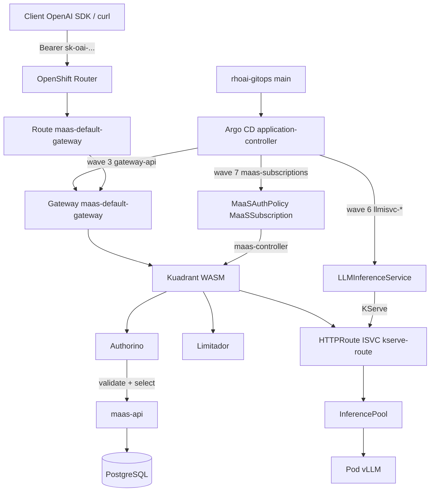
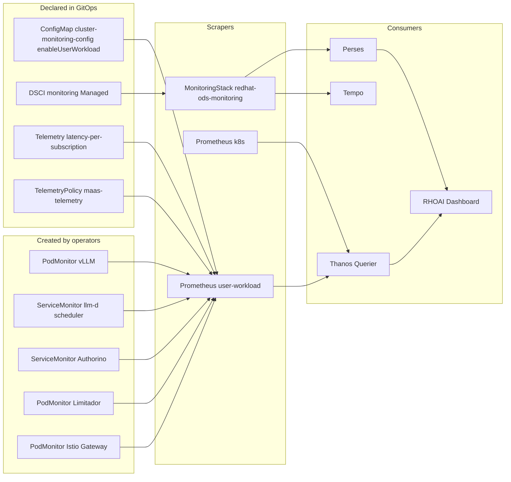
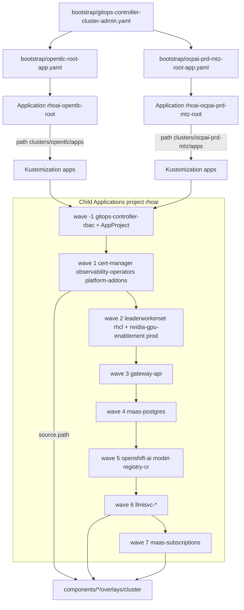
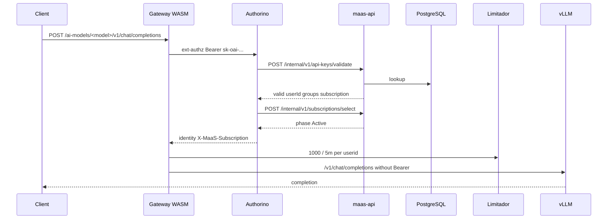

# Architecture — OpenShift GitOps (Kustomize) for RHOAI 3.4 and MaaS

Architecture document for [`abelluque/rhoai-gitops`](https://github.com/abelluque/rhoai-gitops): the GitOps source of truth (Argo CD + Kustomize, **apps-of-apps** pattern) for Red Hat OpenShift AI 3.4 and Models-as-a-Service.

English translation of [`ARCHITECTURE.md`](ARCHITECTURE.md).

Runtime facts were checked on 26 August 2026 against the OpenTLC lab (`cluster-zd9hr`, sandbox1414), where the root Application `rhoai-opentlc-root` reconciles `clusters/opentlc/apps` from this repository (`targetRevision: main`). The `ocpai-prd-mtz` overlay is declared here and is not deployed in that context.

| Item | Value |
| --- | --- |
| Canonical remote | `https://github.com/abelluque/rhoai-gitops.git` |
| Lab root Application | `rhoai-opentlc-root` → `clusters/opentlc/apps` |
| Prod root Application | `rhoai-ocpai-prd-mtz-root` → `clusters/ocpai-prd-mtz/apps` |
| AppProject | `rhoai` (wave −1) |
| Observed product | OpenShift AI Self-Managed **3.4.3**, DSC `default-dsc` Ready |
| Observed serving | KServe **v0.17.0**, vLLM **v0.18.0**, llm-d inference-scheduler **v0.7.1** |

This repository **does not** contain Helm charts. YAML under `components/` is the desired state. The optional importer `hack/import-from-helm.sh` can regenerate them from a sibling [`rhoai-helm`](https://github.com/abelluque/rhoai-helm) checkout; it is not an install prerequisite.

---

## 1. Executive summary

GitOps declares the cluster: OpenShift GitOps (Argo CD) applies versioned Kustomize overlays. A root Application materializes an `AppProject` and child Applications; each child points at `components/<app>/overlays/<cluster>`.

### Purpose

- Install and maintain the platform stack, Connectivity Link, Gateway API, RHOAI 3.4, `LLMInferenceService`, and MaaS subscriptions **without** a Helm tree on the cluster.
- Separate the OpenTLC lab from production `ocpai-prd-mtz` with self-contained overlays (the production overlay **does not** inherit the lab `base`).
- Order dependencies with `argocd.argoproj.io/sync-wave` (−1…7) and `PostSync` Jobs (equivalent to Helm post-install hooks).

### Design patterns

| Pattern | Use in this repo |
| --- | --- |
| **Apps-of-apps** | Bootstrap applies a root Application; that root syncs `clusters/<cluster>/apps` (AppProject + children). |
| **Kustomize base / overlay** | Lab: `components/<app>/base` + `overlays/opentlc` (often only `resources: [../../base]`). Prod: complete manifests in `overlays/ocpai-prd-mtz`. |
| **Sync waves** | OLM operators (1–2) → Gateway (3) → MaaS Postgres (4) → DSC / ModelRegistry (5) → models (6) → subscriptions (7). |
| **Server-Side Apply** | `ServerSideApply=true`, `CreateNamespace=true`, `prune: false`. `SkipDryRunOnMissingResource` on CRs whose CRD does not exist yet. |
| **Gateway API** | `GatewayClass` `openshift-default` (`openshift.io/gateway-controller/v1`). No Service Mesh 3 Application. |
| **Kuadrant / Authorino / Limitador** | RHCL chart rendered to Jobs + Subscription. The `maas-controller` generates AuthPolicy / TokenRateLimitPolicy at runtime. |
| **KServe LLMInferenceService** | RawDeployment + InferencePool + llm-d scheduler. Router to `maas-default-gateway`. |
| **Bootstrap RBAC** | Chicken-and-egg: `oc apply -f bootstrap/gitops-controller-cluster-admin.yaml` **before** the root, because the child `gitops-controller-rbac` cannot create its own `ClusterRoleBinding` without `cluster-admin`. |

Overlays:

| Overlay | Root Application | Inference | Storage | MaaS Postgres | GPU Operator |
| --- | --- | --- | --- | --- | --- |
| `opentlc` | `bootstrap/opentlc-root-app.yaml` | Granite 3.1 2B CPU | `gp3-csi` | In-cluster | No |
| `ocpai-prd-mtz` | `bootstrap/ocpai-prd-mtz-root-app.yaml` | Granite 8B, Qwen 32B, DeepSeek 33B on H200 | `nutanix-files-dynamic` | External (`existingSecret`) | NFD + NVIDIA |

The OpenTLC overlay templates `maas.apps.cluster-6f7dh.6f7dh.sandbox3519.opentlc.com`. The live cluster observed is `cluster-zd9hr` (`router-default.apps.cluster-zd9hr.zd9hr.sandbox1414.opentlc.com`). The Route is Admitted; the hostname in the spec does not match the current sandbox DNS.

---

## 2. Infrastructure and component architecture

### 2.1 Layered view

```text
┌────────────────────────────────────────────────────────────────────────┐
│ bootstrap/  (cluster-admin)                                            │
│   gitops-controller-cluster-admin.yaml                                 │
│   opentlc-root-app.yaml  |  ocpai-prd-mtz-root-app.yaml                │
└────────────────────────────────────────────────────────────────────────┘
                                    │
┌────────────────────────────────────────────────────────────────────────┐
│ clusters/<cluster>/apps  (App-of-Apps, reconciled by the root)         │
│   AppProject rhoai · child Applications (sync-wave −1…7)               │
└────────────────────────────────────────────────────────────────────────┘
                                    │
┌────────────────────────────────────────────────────────────────────────┐
│ components/<app>/overlays/<cluster>  (Kustomize, desired state)        │
└────────────────────────────────────────────────────────────────────────┘
                                    │
          ┌─────────────────────────┴─────────────────────────┐
          ▼                                                   ▼
┌─────────────────────────────┐                 ┌─────────────────────────┐
│ Platform and ingress        │                 │ AI and MaaS planes      │
│ GitOps · cert-manager · UWM │                 │ DSC · KServe · vLLM     │
│ Gateway · Route passthrough │                 │ Kuadrant · maas-api     │
└─────────────────────────────┘                 └─────────────────────────┘
```

### 2.2 Platform and GitOps

| Application | Kustomize path | Destination namespace | Role |
| --- | --- | --- | --- |
| `gitops-controller-rbac` | `components/gitops-controller-rbac/overlays/<cluster>` | cluster | `ClusterRoleBinding` `cluster-admin` on SA `openshift-gitops-argocd-application-controller`. Required for SSA on `openshift-ingress`, operators, and RHOAI. |
| `cert-manager` | `components/cert-manager/overlays/<cluster>` | `cert-manager-operator` | cert-manager operator. Prod: Manual InstallPlan + approve Job. |
| `observability-operators` | `components/observability-operators/overlays/<cluster>` | `openshift-operators` | Tempo, OpenTelemetry, Cluster Observability (Perses). |
| `platform-addons` | `components/platform-addons/overlays/<cluster>` | `rhoai-model-registries` | GitOps + Pipelines (Subscriptions), registry MinIO/MySQL, PVCs, nodePlacement Jobs. |
| `nvidia-gpu-enablement` | `components/nvidia-gpu-enablement/overlays/ocpai-prd-mtz` | `openshift-nfd` | **Prod only.** NFD + GPU Operator + ClusterPolicy. |
| `leaderworkerset` | `components/leaderworkerset/overlays/<cluster>` | `openshift-lws-operator` | KServe llm-d requirement. `PostSync` Job applies the LWS instance. |

`platform-addons` does not include the `ModelRegistry` CR: that lives in a separate Application `model-registry-cr` (wave 5) so it can wait for the RHOAI operator CRDs. The CR uses `kubeRBACProxy: {}` (not `oauthProxy`) because of the RHOAI 3.4 CEL rule.

Jobs that were Helm hooks are annotated `argocd.argoproj.io/hook: PostSync` and `hook-delete-policy: BeforeHookCreation`.

### 2.3 AI control plane

Application `openshift-ai` → `components/openshift-ai/overlays/<cluster>` → `redhat-ods-operator`.

Typical overlay manifests: Subscription `rhods-operator` (`stable-3.x`), Jobs `apply-dsci` / `apply-dsc` / `apply-odh-dashboard-config`, HardwareProfiles, Istio Telemetry, Kuadrant TelemetryPolicy, Authorino NetworkPolicy, `cluster-monitoring-config` (`enableUserWorkload: true`).

Observed DSC (`default-dsc`): KServe + ModelsAsService, Dashboard, ModelRegistry, Llama Stack, TrustyAI, Workbenches **Managed**; pipelines/kueue/ray/trainer **Removed**; `serviceMesh.managementState: Removed`.

Models (wave 6):

| Application | Overlay | LLMInferenceService | Hardware |
| --- | --- | --- | --- |
| `llmisvc-granite` | `components/llmisvc-granite/overlays/opentlc` | `granite-3-1-2b-instruct` | CPU, `rhaii/vllm-cpu-rhel9:3.4.1`, `workload.rhoai.io/platform=true` |
| `llmisvc-granite-8b` | `…/llmisvc-granite-8b/overlays/ocpai-prd-mtz` | `granite-3-0-8b-instruct` | GPU H200 |
| `llmisvc-qwen25-coder-32b` | `…/llmisvc-qwen25-coder-32b/overlays/ocpai-prd-mtz` | `qwen25-coder-32b` | GPU H200 FP8 |
| `llmisvc-deepseek-coder-33b` | `…/llmisvc-deepseek-coder-33b/overlays/ocpai-prd-mtz` | `deepseek-coder-33b` | GPU H200 |

Each ISVC declares `router.gateway.refs` to `maas-default-gateway` in `openshift-ingress`. At runtime KServe creates the HTTPRoute, InferencePool, scheduler ServiceMonitors, and vLLM PodMonitor.

### 2.4 MaaS control plane

| Application | Path | Destination | Role |
| --- | --- | --- | --- |
| `rhcl` | `components/rhcl/overlays/<cluster>` | `kuadrant-system` | Connectivity Link operator. Jobs: `apply-kuadrant`, `patch-rhcl-csv` (`ISTIO_GATEWAY_CONTROLLER_NAMES` includes `openshift.io/gateway-controller/v1`), Authorino TLS/Service, `patch-authorino-ca` (`SSL_CERT_FILE` / service-ca), console plugin. |
| `gateway-api` | `components/gateway-api/overlays/<cluster>` | `openshift-ingress` | `GatewayClass` `openshift-default`, Gateway `maas-default-gateway` with `allowedRoutes` by label `maas.opendatahub.io/gateway-access=true`, **passthrough** Route, ConfigMap `maas-gateway-options` (istio-proxy 2Gi), TLS `router-certs-default`. |
| `maas-postgres` | `components/maas-postgres/overlays/<cluster>` | `redhat-ods-applications` | Lab: Postgres Deployment + Job `create-maas-db-config`. Prod: wiring ConfigMap; real Secret out of band (`clusters/ocpai-prd-mtz/secrets/*.example`). Job `label-gateway-access` labels the namespace for the Gateway. |
| `maas-subscriptions` | `components/maas-subscriptions/overlays/<cluster>` | `models-as-a-service` | `MaaSAuthPolicy`, `MaaSSubscription`, `MaaSModelRef`, Job `patch-tenant-telemetry`. |

**There is no Kuadrant AuthPolicy in Git.** The `maas-controller` (RHOAI operand) materializes them when the ISVC, ModelRef, and subscription exist. In the lab the following were observed:

- `AuthPolicy/maas-auth-granite-3-1-2b-instruct` (Enforced) on `granite-3-1-2b-instruct-kserve-route`
- `AuthPolicy/maas-api-auth-policy` on `maas-api-route`
- `AuthPolicy/gateway-default-auth` (deny by default; Overridden)
- `TokenRateLimitPolicy/maas-trlp-granite-3-1-2b-instruct` — 1000 tokens / 5m

### 2.5 Traffic flow

1. Client → `https://maas.apps.<cluster>.<baseDomain>/ai-models/<model>/v1/chat/completions` with `Authorization: Bearer sk-oai-…`.
2. Route `maas-default-gateway` (**passthrough**, 10m timeout) → Gateway Istio ClusterIP Service, which terminates TLS with the `*.apps` wildcard. HTTPRoutes attach only from namespaces labeled `maas.opendatahub.io/gateway-access=true`.
3. Kuadrant WASM (AuthPolicy + TokenRateLimitPolicy) in the sidecar **before** routing.
4. Authorino: POST `maas-api:8443/internal/v1/api-keys/validate` and `/internal/v1/subscriptions/select`.
5. Limitador: quota per `auth.identity.userid` when `selected_subscription_key` matches.
6. HTTPRoute rewrites to `/v1/chat/completions` → InferencePool :8000 → llm-d scheduler → vLLM pod.

Key management: `/maas-api` and `/v1/models` → `maas-api-route` → `maas-api:8443` (its own AuthPolicy; OpenShift TokenReview if the Bearer is not `sk-oai-`).

The RHOAI dashboard uses Gateway `data-science-gateway`, not the MaaS Gateway. That Gateway is created by the RHOAI operator, not by an overlay in this repo.

---

## 3. Architecture diagrams

### 3.1 Ingress, authentication, and routing to KServe / vLLM



### 3.2 Monitoring

GitOps overlays enable UWM (`cluster-monitoring-config`) and DSCInitialization `monitoring.managementState: Managed`. vLLM, scheduler, Authorino, Limitador, and Istio ServiceMonitor/PodMonitor objects are created by operators at runtime; they are not versioned as application resources except Telemetry / TelemetryPolicy in `openshift-ai`.



### 3.3 App-of-Apps and Kustomize tree



Child Application contract (both overlays, except as noted):

| Wave | Application | `spec.source.path` | `spec.destination.namespace` |
| --- | --- | --- | --- |
| −1 | `gitops-controller-rbac` | `components/gitops-controller-rbac/overlays/<cluster>` | `openshift-gitops` |
| 1 | `cert-manager` | `components/cert-manager/overlays/<cluster>` | `cert-manager-operator` |
| 1 | `observability-operators` | `components/observability-operators/overlays/<cluster>` | `openshift-operators` |
| 1 | `platform-addons` | `components/platform-addons/overlays/<cluster>` | `rhoai-model-registries` |
| 2 | `nvidia-gpu-enablement` | `components/nvidia-gpu-enablement/overlays/ocpai-prd-mtz` | `openshift-nfd` (prod only) |
| 2 | `leaderworkerset` | `components/leaderworkerset/overlays/<cluster>` | `openshift-lws-operator` |
| 2 | `rhcl` | `components/rhcl/overlays/<cluster>` | `kuadrant-system` |
| 3 | `gateway-api` | `components/gateway-api/overlays/<cluster>` | `openshift-ingress` |
| 4 | `maas-postgres` | `components/maas-postgres/overlays/<cluster>` | `redhat-ods-applications` |
| 5 | `openshift-ai` | `components/openshift-ai/overlays/<cluster>` | `redhat-ods-operator` |
| 5 | `model-registry-cr` | `components/model-registry-cr/overlays/<cluster>` | `rhoai-model-registries` |
| 6 | `llmisvc-*` | `components/llmisvc-*/overlays/<cluster>` | `ai-models` |
| 7 | `maas-subscriptions` | `components/maas-subscriptions/overlays/<cluster>` | `models-as-a-service` |

Common child policy: `automated.selfHeal`, `prune: false`, `CreateNamespace=true`, `ServerSideApply=true`, `RespectIgnoreDifferences=true` (Subscription `startingCSV`/`status`, InstallPlan `approved`). Retry: 20 attempts, backoff 15s×2 up to 5m.

The root uses project `default` (must exist before AppProject `rhoai`) and retry 10 / backoff 20s.

---

## 4. Security and authentication configuration

### 4.1 What Git versions vs what the controller generates

**In Git (wave 7)** — product CRs `maas.opendatahub.io`:

Lab (`components/maas-subscriptions/base`):

```yaml
# MaaSAuthPolicy/free-models-access
spec:
  modelRefs:
    - name: granite-3-1-2b-instruct
      namespace: ai-models
  subjects:
    groups:
      - name: system:authenticated
    users: []
```

```yaml
# MaaSSubscription/free-models-subscription
spec:
  modelRefs:
    - name: granite-3-1-2b-instruct
      namespace: ai-models
      tokenRateLimits:
        - limit: 1000
          window: 5m
  owner:
    groups:
      - name: system:authenticated
  priority: 0
```

Prod (`overlays/ocpai-prd-mtz`): `free-models-access` → Granite 8B; `premium-models-access` → Qwen + DeepSeek (`premium-users` + `system:authenticated`); premium subscription 10000 tokens / 2m.

**On the cluster (maas-controller)** — `kuadrant.io/AuthPolicy` and `TokenRateLimitPolicy` targeting the ISVC HTTPRoute and `maas-api-route`. The Gateway has `gateway-default-auth` (deny for unconfigured models); specific routes override it.

The model name in Subscription / AuthPolicy / ModelRef **must** match the `LLMInferenceService` `metadata.name`.

### 4.2 `sk-oai-…` API key flow

There is no key Secret in Git. `maas-api` issues keys and stores them in Postgres (`maas-db-config`). Authorino validates the prefix `^Bearer sk-oai-.*`.



OPA in the generated AuthPolicy (lab):

| Check | Condition |
| --- | --- |
| `auth-valid` | `apiKeyValidation.valid == true` or K8s/OIDC identity |
| `require-group-membership` | group in `system:authenticated` |
| `subscription-valid` | phase `Active` or `Degraded`, no deletionTimestamp |
| Response | `Authorization` is cleared toward vLLM; `X-MaaS-Subscription` is injected |

`maas-api-route` auth: the same key **or** TokenReview (audiences `kubernetes.default.svc`, `maas-default-gateway-sa`). Rejects client headers `x-maas-username` / `x-maas-group`. `GET /maas-api/health` is excluded from the policy.

### 4.3 GitOps RBAC

The default Argo CD SA can only write in `openshift-gitops`. This model owns Gateways in `openshift-ingress`, operator Subscriptions, and cluster-scoped CRs, hence `cluster-admin`.

Procedure:

```bash
oc apply -f bootstrap/gitops-controller-cluster-admin.yaml
oc apply -f bootstrap/opentlc-root-app.yaml   # or ocpai-prd-mtz-root-app.yaml
```

Application `gitops-controller-rbac` reconciles **the same** `ClusterRoleBinding`. `prune: false` on the root avoids deleting platform namespaces if a child desyncs.

Do not version: `HF_TOKEN`, Postgres URLs with passwords, kubeconfigs. Templates live in `clusters/ocpai-prd-mtz/secrets/*.example`.

---

## 5. Integration and observability matrix

| GitOps component | Namespace | Versioned resources | Runtime metrics (lab) |
| --- | --- | --- | --- |
| Argo CD | `openshift-gitops` | Applications, AppProject, ArgoCD CR (via platform-addons) | SM `openshift-gitops`, `…-server`, `…-repo-server` |
| gitops-controller-rbac | cluster | ClusterRoleBinding | — |
| cert-manager | `cert-manager-operator` | Subscription, OperatorGroup, approve Jobs (prod) | OLM operator |
| observability-operators | `openshift-operators` | Tempo / OTel / COO Subscriptions | SM of each operator |
| platform-addons | various | GitOps + Pipelines Subs, MinIO, MySQL, PVCs, placement Jobs | SM Pipelines / GitOps |
| nvidia-gpu-enablement | `openshift-nfd` | NFD + GPU Operator (prod) | GPU Operator metrics |
| leaderworkerset | `openshift-lws-operator` | Subscription, apply LWS Job | SM `lws-controller-manager-metrics-monitor` |
| rhcl | `kuadrant-system` | RHCL Subscription, Kuadrant/Authorino Jobs | SM Authorino / Kuadrant / Limitador operator; PodMonitor Limitador |
| gateway-api | `openshift-ingress` | GatewayClass, Gateway, Route, ConfigMap | PodMonitor `istio-pod-monitor`; Telemetry / TelemetryPolicy (openshift-ai chart) |
| maas-postgres | `redhat-ods-applications` | Lab Postgres **or** prod wiring ConfigMap | — |
| openshift-ai | `redhat-ods-operator` | Subscription, DSC/DSCI/dashboard Jobs, HardwareProfiles, monitoring CM | DSC conditions; SM `odh-model-controller`, `model-serving-api-metrics`; PodMonitor `maas-controller-metrics` |
| model-registry-cr | `rhoai-model-registries` | ModelRegistry `rhoai-registry` (`kubeRBACProxy`) | registry kube-rbac-proxy |
| llmisvc-* | `ai-models` | LLMInferenceService, Namespace | PodMonitor `kserve-llm-isvc-vllm-engine`; SM scheduler |
| maas-subscriptions | `models-as-a-service` | MaaSAuthPolicy, MaaSSubscription, MaaSModelRef, telemetry Job | generated Kuadrant policies; Istio `REQUEST_DURATION` + `subscription` label |

Routes (observed lab):

| Surface | Resource | Hostname / path |
| --- | --- | --- |
| Inference + MaaS API | Gateway + Route `maas-default-gateway` | Git spec: `maas.apps.cluster-6f7dh.6f7dh.sandbox3519.opentlc.com`. Live canonical router: `*.apps.cluster-zd9hr.zd9hr.sandbox1414.opentlc.com` |
| Chat | ISVC HTTPRoute (KServe, not Git) | `/ai-models/granite-3-1-2b-instruct/v1/chat/completions` |
| Keys / catalog | HTTPRoute `maas-api-route` (RHOAI, not Git) | `/maas-api`, `/v1/models` |
| GitOps UI | operator Route | `openshift-gitops-server-openshift-gitops.apps.cluster-zd9hr…` |

Check without secrets: `./hack/argocd-sync-report.sh`. MaaS probe: `./scripts/probe-maas.sh`.

---

## 6. Repository map

```text
rhoai-gitops/
├── bootstrap/
│   ├── gitops-controller-cluster-admin.yaml   # apply first (cluster-admin)
│   ├── opentlc-root-app.yaml
│   └── ocpai-prd-mtz-root-app.yaml
├── clusters/
│   ├── opentlc/apps/                          # lab App-of-Apps Kustomization
│   └── ocpai-prd-mtz/
│       ├── apps/                              # prod App-of-Apps Kustomization
│       └── secrets/*.example                  # no real credentials
├── components/<app>/
│   ├── base/                                  # lab state (OpenTLC)
│   └── overlays/
│       ├── opentlc/                           # usually points at ../../base
│       └── ocpai-prd-mtz/                     # self-contained (does not inherit base)
├── hack/
│   ├── argocd-sync-report.sh
│   ├── import-from-helm.sh                    # optional; overwrites YAML
│   └── split-rendered.py
└── scripts/probe-maas.sh
```

Remote change: replace `https://github.com/abelluque/rhoai-gitops.git` in `bootstrap/*-root-app.yaml`, `clusters/*/apps/appproject.yaml`, and every child Application. Default `targetRevision`: `main`.

---

## 7. Decisions and limits

1. **GitOps is the operational source of truth.** Helm (`rhoai-helm`) is an optional generator. Regenerating with `import-from-helm.sh` **overwrites** `components/`.
2. **No Service Mesh 3.** The Ingress Operator programs `openshift-default`. An SM3 subscription duplicates Istio CRDs and leaves the Gateway unprogrammed.
3. **Self-contained prod overlay.** There is no `bases:` pointing at the lab: hardware, StorageClass, models, and external Postgres are declared in full under `overlays/ocpai-prd-mtz`.
4. **RBAC chicken-and-egg.** Apply the bootstrap ClusterRoleBinding as a cluster-admin user before the root Application.
5. **WaitForFirstConsumer PVCs.** Claims with no consumer (`pipelines-artifacts`, notebooks) stay Pending. `ignore-healthcheck` and PVC health Lua live in the `platform-addons` Job / Argo CD extraConfig, not on every PVC in the lab overlay (the live cluster has the annotation if it was applied from Helm).
6. **ModelRegistry CR in wave 5.** Split from `platform-addons` so dry-run is not run against a missing CRD. Spec: `kubeRBACProxy: {}` (RHOAI 3.4 CEL forbids oauthProxy + kubeRBACProxy).
7. **Lab hostname.** Update Gateway and Route in `components/gateway-api` when the OpenTLC sandbox changes (`6f7dh` → `zd9hr`).
8. **Prod day-0.** GPU labels/taints, `ntnx-secret`, `nfsServerName`, `maas-db-config`, `hf-token`, and MySQL/MinIO placeholders **before** waves 5/6 reconcile.
