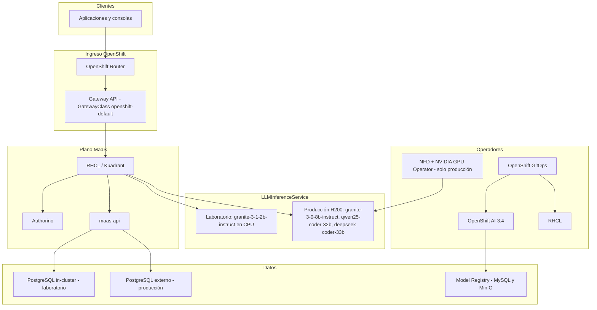

# Red Hat OpenShift AI 3.4 y Models as a Service — GitOps

Este repositorio es la **fuente de verdad** para desplegar Red Hat OpenShift AI 3.4 con Models as a Service (MaaS) mediante **OpenShift GitOps** (Argo CD) y **Kustomize**, siguiendo el patrón **apps-of-apps**.

Los manifiestos Kustomize versionados aquí describen el estado deseado. No es necesario un árbol Helm ni una ruta de sistema de archivos local para operar un cluster. El remoto canónico es:

<https://github.com/abelluque/rhoai-gitops.git>

## Propósito

- Declarar Applications de OpenShift GitOps, un `AppProject` y overlays Kustomize por cluster.
- Instalar y configurar la pila de plataforma (cert-manager, observabilidad, GitOps, Pipelines, Model Registry), Red Hat Connectivity Link, Gateway API, OpenShift AI 3.4, LLMInferenceServices y suscripciones MaaS.
- Separar el laboratorio OpenTLC de la producción `ocpai-prd-mtz` sin compartir valores de hardware, almacenamiento ni modelos.

## Estructura del repositorio

```
rhoai-gitops/
├── bootstrap/                          Application raíz (se aplica una vez por cluster)
│   ├── opentlc-root-app.yaml
│   └── ocpai-prd-mtz-root-app.yaml
├── clusters/
│   ├── opentlc/apps/                   App-of-apps de laboratorio
│   └── ocpai-prd-mtz/
│       ├── apps/                       App-of-apps de producción
│       └── secrets/                    Ejemplos de Secret (sin credenciales reales)
├── components/<aplicación>/
│   ├── base/                           Manifiestos de laboratorio (OpenTLC)
│   └── overlays/
│       ├── opentlc/                    Overlay de laboratorio
│       └── ocpai-prd-mtz/              Overlay de producción (autosuficiente)
├── hack/                               Importador opcional desde un repo de charts
└── scripts/probe-maas.sh               Comprobación de la API MaaS
```

Las Applications hijas apuntan a `components/<nombre>/overlays/<cluster>`. El overlay de producción **no** hereda el `base` de laboratorio: hardware, modelos y almacenamiento se declaran por completo en `overlays/ocpai-prd-mtz`.

## Overlays de cluster

| Overlay | Función | OpenShift | Cómputo de inferencia | Almacenamiento | PostgreSQL MaaS | GPU Operator | Modelos |
| --- | --- | --- | --- | --- | --- | --- | --- |
| `opentlc` | Laboratorio | sandbox | CPU (`workload.rhoai.io/platform=true`) | `gp3-csi` | In-cluster | No | Granite 3.1 2B Instruct (SLM CPU) |
| `ocpai-prd-mtz` | Producción | 4.22 | SuperMicro SYS-521GE-TNRT, 2 nodos × 6 GPU NVIDIA H200 | Nutanix Files (`nutanix-files-dynamic`) | Externo (`existingSecret: maas-db-config`) | NFD + NVIDIA GPU Operator | Granite 3.0 8B Instruct, Qwen2.5-Coder 32B FP8, DeepSeek-Coder 33B |

### Laboratorio (`opentlc`)

Tres masters, workers CPU. Gateway MaaS publicado con Route sobre el Ingress del cluster. Un único `LLMInferenceService` en CPU (`VLLM_CPU_KVCACHE_SPACE=4`). No se instala NVIDIA GPU Operator. Postgres de MaaS se despliega en `redhat-ods-applications`.

### Producción (`ocpai-prd-mtz`)

Topología de 11 nodos: 3 masters no schedulable, 3 infra VM, 3 workers virtuales y 2 SuperMicro GPU. Las cargas de plataforma (OpenShift AI, GitOps, Pipelines, RHCL, Authorino, Model Registry) usan el label `workload.rhoai.io/platform=true`. Los nodos GPU llevan taint `nvidia.com/gpu=true:NoSchedule`. La inferencia declara `nodeSelector` `nvidia.com/gpu.present=true`, recursos `nvidia.com/gpu` y HardwareProfiles `cpu-platform` y `gpu` (NVIDIA H200, máximo 6 GPU por perfil).

El StorageClass `nutanix-files-dynamic` (CSI `csi.nutanix.com`, `NutanixFiles`) es la clase por defecto. El parámetro `nfsServerName` permanece en `CHANGE_ME` hasta que el operador lo sustituya por el nombre corto del File Server en Prism. El Secret CSI `ntnx-secret` debe existir en `openshift-cluster-csi-drivers`.

PVCs previstos: MySQL del registry 20 Gi RWO, MinIO 200 Gi RWX, workbenches 50 Gi RWX, artefactos de Pipelines 100 Gi RWX.

## Arquitectura de despliegue



El tráfico de clientes alcanza el **OpenShift Router**, que expone el Gateway MaaS (`maas.apps.<cluster>.<baseDomain>`). El Gateway (`openshift.io/gateway-controller/v1`) envía las peticiones a **RHCL / Authorino** y a **maas-api**. Las inferencias se atienden en `LLMInferenceService`. OpenShift GitOps reconcilia operadores y operandos. El Model Registry persiste metadatos en MySQL y artefactos en MinIO.

## Gateway API: no instalar Service Mesh 3

**No se instala el operador OpenShift Service Mesh 3.** No existe Application ni overlay para `service-mesh-operators`.

En OpenShift 4.22 el Ingress Operator publica las CRDs de Gateway API. La `GatewayClass` `openshift-default` (`controllerName: openshift.io/gateway-controller/v1`) provoca que el Ingress Operator despliegue un plano de control Istio ligero en `openshift-ingress`. Una suscripción OLM adicional a Service Mesh 3 duplica CRDs de Istio y puede dejar el Gateway sin programar, con impacto en Connectivity Link y MaaS.

OpenShift AI declara `serviceMesh.managementState: Removed` para no gestionar Service Mesh 2. RHCL ya incluye el controlador `openshift.io/gateway-controller/v1`. El `Gateway` MaaS usa esa clase.

## Orden de sincronización (sync-wave)

Argo CD aplica las Applications hijas según `argocd.argoproj.io/sync-wave`. Los Jobs que en Helm eran hooks `post-install` / `post-upgrade` se anotan como `argocd.argoproj.io/hook: PostSync`.

| Wave | Application | Namespace de destino | OpenTLC | ocpai-prd-mtz |
| --- | --- | --- | --- | --- |
| −1 | `AppProject` `rhoai` | `openshift-gitops` | Sí | Sí |
| 1 | `cert-manager` | `cert-manager-operator` | Sí | Sí |
| 1 | `observability-operators` | `openshift-operators` | Sí | Sí |
| 1 | `platform-addons` | `rhoai-model-registries` | Sí | Sí |
| 2 | `nvidia-gpu-enablement` | `openshift-nfd` | No | Sí (NFD + GPU Operator) |
| 2 | `leaderworkerset` | `openshift-lws-operator` | Sí | Sí |
| 2 | `rhcl` | `kuadrant-system` | Sí | Sí |
| 3 | `gateway-api` | `openshift-ingress` | Sí | Sí |
| 4 | `maas-postgres` | `redhat-ods-applications` | Postgres in-cluster | Solo wiring externo |
| 5 | `openshift-ai` | `redhat-ods-operator` | Sí | Sí (RHOAI 3.4, canal `stable-3.x`) |
| 6 | Modelos (`llmisvc-*`) | `ai-models` | `llmisvc-granite` (CPU) | `llmisvc-granite-8b`, `llmisvc-qwen25-coder-32b`, `llmisvc-deepseek-coder-33b` |
| 7 | `maas-subscriptions` | `models-as-a-service` | Granite 2B | Granite 8B (free); Qwen y DeepSeek (premium) |

`CreateNamespace=true` y `ServerSideApply=true` están habilitados en las Applications hijas. `prune: false` evita borrar Namespaces de plataforma si una Application se desincroniza.

## Procedimiento de arranque

OpenShift GitOps debe existir en `openshift-gitops` **antes** de aplicar la Application raíz. En un cluster vacío, instalar el operador OpenShift GitOps por OLM y esperar el CSV `Succeeded`.

### 1. Elegir el overlay

- Laboratorio: `bootstrap/opentlc-root-app.yaml`
- Producción: `bootstrap/ocpai-prd-mtz-root-app.yaml`

### 2. Requisitos de producción (day-0)

Completar **antes** de que la wave 5 reconcilie MaaS:

1. Confirmar cluster-admin en `ocpai-prd-mtz` (OpenShift 4.22).
2. Etiquetar nodos de plataforma: `workload.rhoai.io/platform=true`.
3. Aplicar taint GPU: `nvidia.com/gpu=true:NoSchedule` y label `nvidia.com/gpu.present=true` en los SuperMicro.
4. Verificar el Secret CSI `ntnx-secret` y sustituir `nfsServerName` en el StorageClass del overlay.
5. Crear el Secret `maas-db-config` en `redhat-ods-applications` con la clave `DB_CONNECTION_URL`. No versionar contraseñas de producción. Plantilla: `clusters/ocpai-prd-mtz/secrets/maas-db-config.yaml.example`.
6. Sustituir los placeholders `CHANGE_ME` de MySQL y MinIO del Model Registry en `components/platform-addons/overlays/ocpai-prd-mtz` (o Secrets equivalentes).
7. Tras existir el Namespace `ai-models`, crear el Secret `hf-token` (`clusters/ocpai-prd-mtz/secrets/hf-token.yaml.example`).
8. Ajustar el hostname MaaS (`maas.apps.ocpai-prd-mtz.<baseDomain>`) en Gateway y Route si el dominio de aplicaciones no es `mtz.local`.
9. Aprobar InstallPlans cuando `installPlanApproval` sea `Manual`.

El overlay de producción **no** incluye el Secret de Postgres con credenciales reales. Argo CD no debe sobrescribir un Secret provisionado fuera de banda: el manifiesto GitOps documenta `existingSecret: maas-db-config` mediante un ConfigMap.

### 3. Aplicar la Application raíz

```bash
oc apply -f bootstrap/opentlc-root-app.yaml
# o
oc apply -f bootstrap/ocpai-prd-mtz-root-app.yaml

oc -n openshift-gitops get applications.argoproj.io
```

Argo CD crea el `AppProject` `rhoai` y las Applications hijas. Las waves 1 a 7 ordenan el sync.

### 4. Verificar

```bash
oc get applications.argoproj.io -n openshift-gitops
oc get datasciencecluster,dscinitialization -A
oc get gateway,route -n openshift-ingress
oc get llminferenceservice -n ai-models
```

En producción, cada SuperMicro debe mostrar `nvidia.com/gpu: 6` allocatable después de la wave 2.

Comprobación de la API MaaS (token de `oc`):

```bash
./scripts/probe-maas.sh
MODEL=granite-3-0-8b-instruct ./scripts/probe-maas.sh
```

## Cambio de repoURL

Si el remoto Git no es el canónico, reemplazar `https://github.com/abelluque/rhoai-gitops.git` en:

- `bootstrap/opentlc-root-app.yaml`
- `bootstrap/ocpai-prd-mtz-root-app.yaml`
- `clusters/opentlc/apps/appproject.yaml`
- `clusters/opentlc/apps/*.yaml` (`spec.source.repoURL`)
- `clusters/ocpai-prd-mtz/apps/appproject.yaml`
- `clusters/ocpai-prd-mtz/apps/*.yaml` (`spec.source.repoURL`)

`targetRevision` por defecto es `main`.

## Mantenimiento de manifiestos

Los YAML bajo `components/` son el estado deseado. Los cambios operativos (dominio, `nfsServerName`, perfiles, réplicas) se hacen en el overlay del cluster y se sincronizan con GitOps.

`hack/import-from-helm.sh` es **opcional** y solo aplica a quien disponga de un checkout hermano llamado `rhoai-helm` (o la variable `HELM_ROOT`). Regenerar **sobrescribe** manifiestos. No es un prerrequisito de instalación.

## Notas

- Helm `lookup` de objetos preexistentes no aplica: GitOps declara el estado. Si el Namespace ya existe, Argo CD lo adopta.
- No hay overlay de Service Mesh 3 en ningún cluster de este repositorio.
- No versionar kubeconfigs ni tokens (`HF_TOKEN`, URLs de Postgres con contraseña).
